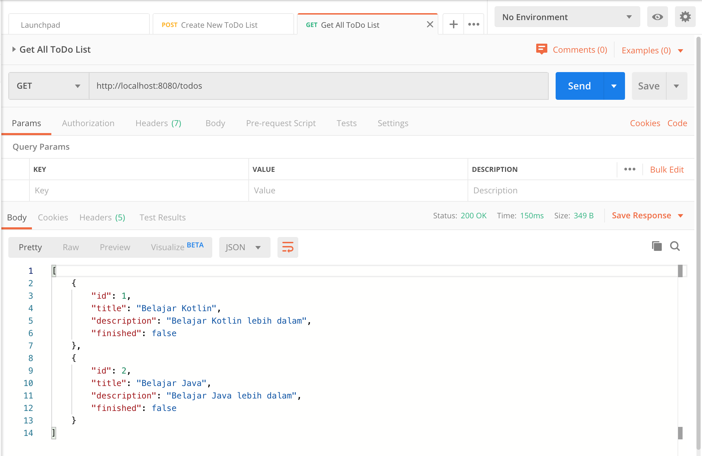

# Kotlin-ToDo-List-Rest-API

## Things to do list:
1. Clone this repository: `git clone https://github.com/hendisantika/Kotlin-ToDo-List-Rest-API.git`.
2. Go to your folder: `cd Kotlin-ToDo-List-Rest-API`.
3. Run the application: `gradle clean bootRun`
4. Open POSTMAN / Insomnia Application.

## Screen shot
**Add New ToDo List**

**Get All ToDo List**

**Get ToDo List By Id**

**Update ToDo List By Id**

**Delete ToDo List By Id**

Or You can import POSTMAN Collection as I attached in thi repository.
